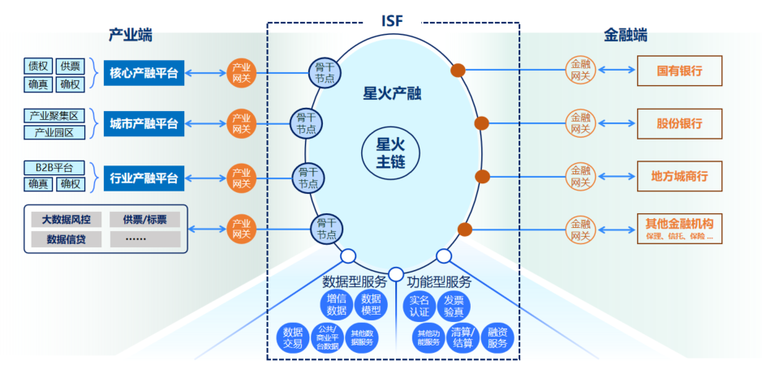

    

&ensp;&ensp;&ensp;&ensp;“星火·链网”是基于<kbd>分布式标识BID</kbd>与 <kbd>区块链</kbd>技术建设的新型融合基础设施，面向全球业务用户、DApp开发者、节点运营方等多种角色提供开放、稳定、安全、易用、高性能区块链网络。 
​&ensp;&ensp;&ensp;&ensp;为推动“星火·链网”与产业的深度融合、实现基础设施建设和产业发展的双协同，中国信通院联合区块链创新企业推出一批产品应用与公共服务，探索区块链在金融、环保、民生、司法等领域的运用。 
​&ensp;&ensp;&ensp;&ensp;在这里你可以找到基于分布式标识和区块链的各类星火产品应用的<kbd>能力介绍</kbd>、<kbd>使用指南</kbd>或者<kbd>API接口</kbd>，帮助你快速接入星火应用生态，共同促进产业数字化进程，开启数据要素自主管理的新时代。 

> 对于希望搭建测试节点体验的用户，“星火·链网”提供了基于底层链的自主开发方法，开发工具，可查阅：

| **[星火链开发指南](https://bif-doc.readthedocs.io/zh_CN/2.0.0/)** | &nbsp;**[星火链网官网](https://bitfactory.cn/)** |
| ---------------------------------------------------------- | ------------------------------------------ |
| :5000p                                                     | :5000p                                     |
| 基于星火链进行智能合约开发、交易上链等操作的技术文档，并提供多语言SDK等开发工具支持。               | 汇总星火链网及其生态的服务入口与相关资讯。                      |

> 若您有相关业务需求及合作意向，请填写问卷 **[联系我们](https://fs80.cn/ultycz)** 

    

|                                                              |                                                              |
| :----------------------------------------------------------- | ------------------------------------------------------------ |
| :5000p                                                       | :5000p                                                       |
| **[节点运营服务](/docs/骨干节点接入服务/超级节点服务平台/超级节点服务平台.md)**  骨干节点是星火·链网主链资源服务与产业应用相结合的连接器，是星火·链网为各类区块链项目及应用赋能的关键设施，向上锚定对接星火主链，向下运营维护行业/区域链上应用的角色，提供子链接入管理、数字身份管理、标识资源分配等基础服务能力，以扩大互通为目的，接入行业/区域应用，构建行业/区域的产业生态集群发展模式。 | 
    
  |
| 
    
  | **[数字身份服务](/docs/数字身份服务/数字身份平台/数字身份平台.md)**  星火数字身份服务是基于星火·链网构建的分布式数字身份服务，将用户身份标识与星火·链网主链账户地址进行融合，提供数字身份一站式全流程管理，帮助用户更方便地通过星火数字身份服务进行证书颁发、管理及验证。从而不再依赖于传统的IDP，而是通过自主管理和表达其身份信息，开启BID即身份的Web世界。 |
| **[数字原生资产服务](/docs/数字原生资产服务/DNA注册认证平台/DNA注册认证平台.md)**  数字原生资产服务基于星火·链网的主链，通过DNA协议（基于ERC721改造的星火链网数字原生资产协议）部署的DNA合约封装为标准化API，提供链上注册数字资产、转移数字资产等接口服务，方便客户快速基于星火主链构建数字藏品等链上数字资产应用。 | 
    
       |
| 
    
     | **[可信存证服务](/docs/可信存证服务/可信存证服务网络/可信存证服务网络.md)**  可信存证服务基于BID标识体系，面向骨干节点用户及可信企业用户提供安全、便捷的电子数据存证和核验服务。提供文件存证和Hash存证，提供原文件核验和文件BID查验。 |
| **[智能安全金融服务](/docs/智能安全金融服务/星火产融平台/星火产融平台.md)**  为提升地方政府的产业金融服务支持能力，真正将区块链服务到实体经济中，解决小微企业融资难、融资贵的问题，搭建星火·链网产融技术服务体系、实现各地政府通过一次对接多处复用的高效协同模式。 | 
    
       |
| 
    
       | **[碳数据服务网络](/docs/碳数据服务/产品碳足迹数据服务平台/产品碳足迹数据服务平台.md)**  碳数据服务网络（Carbon data Reliable Circulation, CRC）依托国家工业互联网标识解析体系和面向全球的新型基础设施星火·链网，以激发碳数据要素活力，实现全产业链、全价值链的碳数据可信为主要目标，充分运用标识解析、分布式数字身份、智能合约、隐私计算、工业大数据等技术，面向产品、企业、区域、供应链等对象，具备碳数据精确采集、标识赋码、可信存证、认证核验、资产开发、价值流通和监测监管等功能的公共服务网络。 |
| **[数据要素服务](/docs/数据要素服务/数据智能服务中心/数据智能服务中心.md)**  数据要素服务-数据智能服务中心DDI网络，依托“星火，链网”以及国家工业互联网标识解析体系等新型基础设施资源汇集的计算能力和数据基础提供面向政府的治理智能支持服务 (Intelligent Goverance Support Services,IGS)和面向企业与市场的商业智能搜索服务 (Intelligent Business Search Services,IBS)助力产业数字化转型升级，从而在更广范围、更深程度、更高水平上推动数字经济发展。 | 
    
       |
