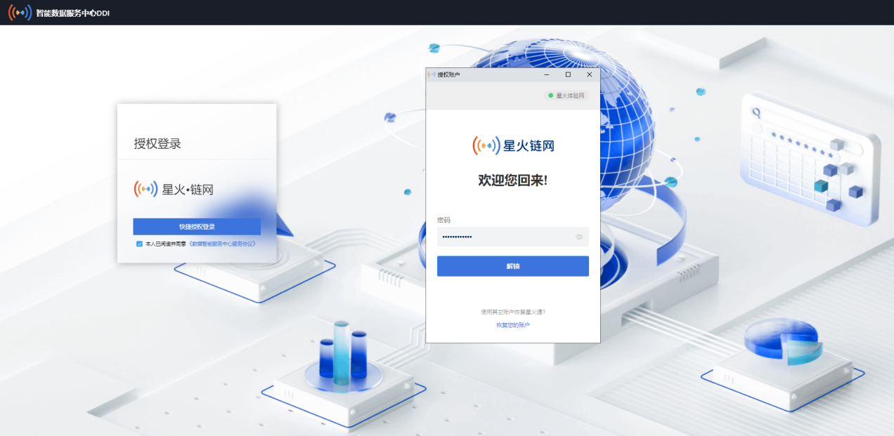
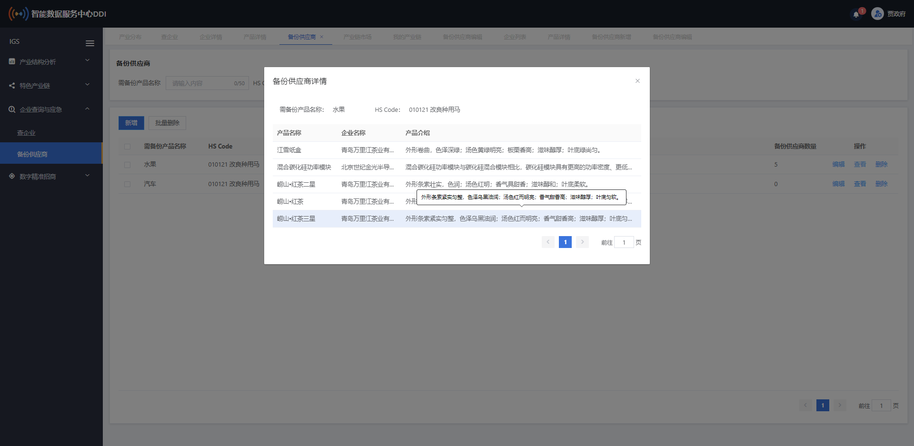

# 数据智能服务中心

## 产品简介

------

星火智服中心DDI网络依托“星火·链网”以及国家工业互联网标识解析体系等新型基础设施汇集的计算能力和数据基础，提供面向政府的治理智能支持服务（Intelligent Governance Support Services, IGS）和面向企业与市场的商业智能搜索服务（Intelligent Business Search Services, IBS），高效助力产业数字化转型升级，旨在从更广范围、更深程度、更高水平上推动数字经济发展。

> 访问地址：https://bj-ddi.bitfactory.cn/

### 应用场景

**场景一：企业查询与供需对接**

以企业为主要服务对象，开发以产业、企业和产品为主体的搜索引擎，企业通过平台可以面向全网展示自己资质与产品，解决企业找供应商难、识别供应商难的问题，实现供需对接，促进国内国外双循环。 

**场景二：开展区域产业链治理**

打造区域政府的数字基础设施，帮助政府快速了解当地产业结构、企业信息，摸清产业链及各个环节情况。助力政府进行产业分析、产业链管理、产业应急管理、数字精准招商等。

### 主要功能 

### 技术特性

**服务架构**

服务架构方面系统采用的是SpringCloud 微服务架构，完全遵循阿里巴巴编码规范。采用 Spring Boot 2、Spring Cloud Greenwich、Mybatis 等核心技术，同时提供基于 React 和 Vue 的两个前端框架用于开发微服务系统平台。机构采用了前后端分离的模式，前端开发两个框架：Sword（基于 React、Ant Design）、Saber（基于 Vue、ElementUI）。后端采用 SpringCloud 系列，对基础组件做了高度的封装，单独出一个后端核心框架。同时深度定制了日志模块，支持分布式日志追踪功能，也为系统的高并发场景提供相关支持。

**隐私计算模型评估**

模型评估模块采用的是隐私计算技术，在对企业指标进行计算评估时，保护企业数据本身不对外泄露的前提下实现数据分析计算的技术集合，达到对企业数据“可用、不可见”的目的。计算的过程是处在可信计算环境，通过加密、认证、完整性和远程证明等方法，确保计算结果的可信性。涵盖了隐私信息的机密性、完整性、可用性和隐私性等多个方面的保护需求，同时也提供了隐私度量、隐私泄漏代价、隐私保护与隐私分析复杂性的可计算模型与公理化的技术实现。

**区块链交易存储**

系统的交易信息存储及溯源使用了星火·链网区块链技术进行记录，区块链数据难以篡改和去中心化，可以记录和存储各种信息，并且可以保证信息的真实性和可靠性。

## 用户使用手册

------

### 1 说明

#### 1.1 目的

本节描述软件使用说明文档的目的是：充足表达软件所能实现的功能及其运转环境, 以便使用者认识本软件的使用范围和使用方法。

#### 1.2 范围

本文档的预期读者包括：企业用户、政府用户。

#### 1.3 术语

| **术语全称**                     | **缩写** | **说明**                                                     |
| -------------------------------- | -------- | ------------------------------------------------------------ |
| 智能服务中心                     | DDI      | Decentralized Data Intelligent Services Center               |
| 面向政府的治理智能支持服务       | IGS      | Intelligent Governance Support Services                      |
| 面向企业与市场的商业智能搜索服务 | IBS      | Intelligent Business Search Services                         |
| 中国安全虚拟化                   | CSV      | China Security Virtualization                                |
| 区块链标识符                     | BID      | Blockchain Identifiers                                       |
| 可信执行环境                     | TEE      | Trusted Execution Environment                                |
| 国民经济行业分类                 | GB code  | 国家统计局颁布的GB/T 4754—2017标准                           |
| 商品名称及编码协调制度           | HS code  | The Harmonization System Code                                |
| 所有经济活动的国际标准行业分类   | ISIC     | The International Standard Industrial Classification of All Economic Activities (ISIC) |

#### 1.4 系统简述

星火智服中心DDI网络系统依托“星火·链网”以及国家工业互联网标识解析体系等新型基础设施资源汇集的计算能力和数据基础，提供面向政府的治理智能支持服务（Intelligent Governance Support Services,IGS），和面向企业与市场的商业智能搜索服务（Intelligent Business Search Services, IBS），助力产业数字化转型升级，从而在更广范围、更深程度、更高水平上推动数字经济发展。

### 2 系统介绍

企业用户可以通过本平台进行企业入驻、产品备案和智慧商业搜索（企业和产品的多维检索）。通过移动端登录后，进行企业、产品的搜索。

政府端用户可以通过本平台进行产业结构分析、特色产业链构建发布和消费、企业查询和应急、数字精准招商。通过移动端登录后，查看产业分布、行业晴雨表、产业链、企业、和产品的信息。通过数据大屏，对DDI整体、产业结构、产业链、企业图谱进行全面分析和展示。

#### 2.1 运行环境

支持用户在macos 10及以上和windows 7及以上双操作系统下运行本产品。支持主流浏览器chrome浏览器 （99.0.4844.51（正式版本） (x86_64) ），360极速浏览器 12.2.1640.0 ）极速模式。

#### 2.2 功能列表

一、基础功能

| **功能类别** | **子功能**               |
| ------------ | ------------------------ |
| 基础功能     | 产品页（星火链官网链接） |
| 基础功能     | 登录                     |
| 基础功能     | 插件安装                 |
| 基础功能     | 政府/企业用户选择        |
| 基础功能     | 消息通知                 |
| 基础功能     | 我的消费                 |

二、治理智能支持服务IGS

| **功能类别**       | **子功能** |
| ------------------ | ---------- |
| 产业结构分析       | 产业分布   |
| 产业结构分析       | 产业洞察   |
| 产业结构分析       | 行业全貌   |
| 产业结构分析       | 行业晴雨表 |
| 产业结构分析       | 产业对标   |
| 特色产业链         | 产业链市场 |
| 特色产业链         | 我的产业链 |
| 特色产业链         | 产业链详情 |
| 特色产业链         | 产业链分析 |
| 特色产业链         | 产业链洞察 |
| 企业查询与应急管理 | 查企业     |
| 企业查询与应急管理 | 企业列表   |
| 企业查询与应急管理 | 企业详情   |
| 企业查询与应急管理 | 产品详情   |
| 企业查询与应急管理 | 备份供应商 |
| 数字精准招商       | 产业链优化 |
| 数字精准招商       | 招商目录   |
| 数字精准招商       | 企业评估   |

三、商业智能搜索服务IBS

| **功能类别** | **子功能**   |
| ------------ | ------------ |
| 商业智能搜索 | 商业智能搜索 |
| 商业智能搜索 | 企业列表     |
| 商业智能搜索 | 企业详情     |
| 商业智能搜索 | 产品列表     |
| 商业智能搜索 | 产品详情     |
| 企业及产品   | 企业主页     |
| 企业及产品   | 产品管理     |

### 3 产品页

产品页对平台整体进行介绍，包括数字资产统计、智能服务中心介绍、治理智能支持服务IGS、商业智能搜索IBS、数据要素流转模式、以及系统推荐企业。点击登陆按钮跳转到登录页面。

图3.1
​                                                                                                                            

### 4 登录

已安装星火通插件点击可以登录可以调用插件进行授权登录。首次登录用户需要选择企业或者政府，选择政府需联系管理分配账号，选择企业登录成功。

在产品页点击登录按钮后进入到系统登录页。（图4.1）

图4.1
                                                                                  

系统通过星火·链网的星火通浏览器插件进行登录，登录时系统会自动校验插件是否安装，未安装插件是系统会弹窗提示用户安装插件。（图4.2）用户根据提示安装星火通插件。

   
图4.2
 

插件安装成功后，重新进入登录页，点击快捷授权登录，便可进到授权登录页面（图4.3），未勾选数据智能服务中心服务协议，点击快捷授权登录按钮，示请阅读并同意《数据智能服务中心服务协议》（图4.4）。勾选协议后，输入正确的密码点击解锁按钮，成功后进入到授权页面。（图4.5）

 图4.3 

图4.4

图4.5

点击授权账户下的账户（图4.5）可以选择授权登录的账户（图4.6）

 图4.6 

点击选择要授权的账户后返回到授权页（图4.5），点击下一步进入到链接页（图4.7）。

图4.7

击连接后即授权成功，点击确定后登录成功。（图4.8）

图4.8

授权过程中点击取消后返回登录页并弹出提示：用户取消授权。（图4.9）

图4.9

新用户登录后会进入角色选择页，以确定当前登录的星火通账户所绑定的角色（图4.10）。选定角色后再次登录则无需选择直接进入对应角色的页面。

图4.10

选择政府角色时会弹出提示页（图4.11），若当前用户需要成为政府角色，请联系后台管理人员进行操作（具体操作方式请参考后台管理员手册）。

图4.11

选择企业用户后，会进入企业用户对应的页面。企业用户首次登录时，会进入企业主页，需按照提示流程进行企业认证。（图4.12）未认证通过前点击商业智能搜索和产品管理菜单时会提示无权访问当前页面。（图4.13）点击企业信息上链并领取企信码返回认证页。

图4.12

图4.13

认证方式按照图4.13红框内的提示进行操作。企业认证成功并上链成功之后，就会进入对应的企业主页。（图4.14）

 
图4.14

### 5 我的消费

鼠标放到页面右上角的用户名称处，会出现下拉框（图5.1），点击我的消费菜单进入我的消费页（图5.2）。

图5.1

图5.2

我的消费页主要展示当前登录用户所产生的所有消费信息（当前消费类型见图5.3）。可以根据消费类型和交易时间段查询消费信息。页面左上角部分显示当前登录用户剩余的星火令数量。

图5.3

### 6 消息通知

鼠标移到右上方铃铛处会展示当前登录用户所收到的消息通知列表（图6.1）。点击查看所有消息则进入我的消息列表页，消息支持单个查看和批量已读（图6.2）。

图6.1

图6.2

点击批量已读按钮会将当前登录者所接收到的所有未读消息变更为已读。

### 7 产业结构分析

#### 7.1 产业分布

产业地图和可视化。可查看由详细数据所生成的全国或区域热点地图。（图7.1）主要以行政区划为单位或根据用户自定义行业进行展示，同时可视化展示区域产业详细数据的筛选维度。

图7.1

右上角选择行业门类可以查看指定门类下的产业分布情况（图7.2），选择门类后可以选择当前门类下的大类进行查看。

图7.2

点击左上方的全国、山东省、青岛市、胶州市可以查看对应地区的产业分布情况（以全国为例，图7.3）。

图7.3

#### 7.2 产业洞察

###### 企业分析

点击产业洞察菜单进入产业洞察页面。当前页面默认展示胶州市的所有企业数量，选择行业后可以查看该行业下的所有企业数量。界面展示企业数量，新增开业企业，闭业企业，上市企业，外商投资及合作企业。企业分布展示注册资本分布图范围在50万以下，50到100万，100到500万，500到2000万，2000万以上。企业年龄分布展示范围1年以下，1到3年，3到5年，5到10年，10年以上。（图7.1.2.1）

图7.1.2.1

增长趋势图显示2021年企业数量涨幅和企业数量年均涨幅，三年内的企业数量同比涨幅。（图7.1.2.2）

图7.1.2.2

产业分类展示各个行业的企业数量和企业数量占全国之比。（图7.1.2.3）

图7.1.2.3

###### 营收分析

企业分布展示营收贡献度和企业营收分布饼图，营收规模，营收规模增量，上市企业营收规模占比 ，行业集中度。营收贡献度展示规则：不同营收规模区间的企业营收规模之和占全行业营收规模之比。企业营收分布规则：不同营收规模区间的企业数量占行业之比。（图7.1.2.4）

图7.1.2.4

增长趋势界面展示2021年营收规模涨幅和营收规模年均涨幅（图7.1.2.5）

图7.1.2.5

产业分类展示各个行业的营收规模，营收规模占全国之比。（图7.1.2.6）

图7.1.2.6

###### 人力分析

人力分析界面展示城镇人力规模，城镇人力规模增量，企业平均人力规模，企业员工平均营收。人力贡献度和企业人力分布饼图。人力共享度规则：不同城镇人力规模区间的企业城镇人力规模之和所选行业城镇人力规模之比。（图7.1.2.7）

图7.1.2.7

增长趋势界面显示2021城镇人力规模涨幅，城镇人力规模年均涨幅。（图7.1.2.8）

图7.1.2.8

产业分类界面展示各个行业的城镇人力规模和城镇人力规模占全国之比（图7.1.2.9）

图7.1.2.9

###### 创新分析

企业分布界面展示专利数量，专利增量，人均专利数，行业创新速度。专业收益贡献度饼图和专利数量分布饼图。专业收益贡献度规则：不同专利数量区间的企业收入规模之和占全行业收入规模之比。（图7.1.2.10）

图7.1.2.10

增长趋势界面显示2021年专利数量涨幅，专利数量年均涨幅。（图7.1.2.11）

图7.1.2.11

产业分类界面展示各个行业的专利总数，专利总数占全国之比。（图7.1.2.12）

图7.1.2.12

#### 7.3 行业全貌

点击行业全貌菜单进入行业全貌页面。当前页面默认不查询数据，需选择行业后才可进行搜索。直接点击搜索时会弹出提示（图7.1.3.1）。

图7.1.3.1

只选择行业门类，不选择行业大类点击搜索，会查询出当前所选行业的大类列表（如图7.1.3.2），若选择行业门类后再选择行业大类查询，则会查询出当前所选行业大类下的所有行业中类的列表（如图7.1.3.3）。点击清空按钮会清空所有搜索条件，同时清空查询列表数据。

图7.1.3.2

图7.1.3.3

企业数量、占比、员工人数、占比、收入规模、占比、上市公司数量、外资企业数量、行业收入规模增长率都有排序（如图7.1.3.3），未点击排序图标时无排序，点击上述列表标题后方的上下三角后会按照指定的目标排序。向上箭头亮起为正序排序，向下箭头亮起为倒序排序。

#### 7.4 行业晴雨表

点击行业晴雨表菜单进入行业晴雨表页，默认不展示数据（图7.1.4.1）。需至少选择一个行业门类后才可进行搜索，直接点击搜索会弹出提示。

图7.1.4.1

选择一个行业门类后点击搜索可以查看当前行业门类下所有大类的晴雨表数据。每列数据表头后方有个“？”，鼠标移动到上面可以查看当前列数据的计算方式（图7.1.4.2），计算结果大于10%用太阳标志表示，0-10%用阴云标志表示，小于0%用降雨标志表示。

图7.1.4.2

#### 7.5 产业对标

点击产业对标菜单可以进入产业对标页，默认不展示数据，需选择行业门类后才可进行搜索。直接点击搜索会有提示（图7.1.5.1）

图7.1.5.1

图7.1.5.2

只选择行业门类点击检索时展示行业大类数据，再次选择行业大类点击检索时展示行业中类数据。（如图7.1.5.2）

右上角<code>1</code>的位置可以切换查看收入规模和员工人数的柱状图，<code>2</code>的位置可以点击单独查看对应地区的收入规模或全国均值的收入规模。

**长板分析**：当胶州行业的数值大于全国行业的平均值时为长板行业（页面以行业为维度去查看时---只下拉选择行业不选择行业大类---长板分析展示当前所选行业下的行业大类的维度，长板推荐企业展示当前长板分析中所包含的行业大类下所有中类和小类下的所有企业；页面以行业大类为维度去查看时---下拉选择行业同时选择行业大类---长板分析展示当前所选行业大类下的行业中类的维度，长板推荐企业展示当前长板分析中所包含的行业种类以及行业中类下所有小类的所有企业。），取胶州数值减去全国均值的差值前三名。不足三名有几个显示几个，超过三名只显示三名。（不足一名展示“-”）

**短板分析**：当胶州行业的绝对值小于全国行业的平均值时为短板行业（页面以行业为维度去查看时---只下拉选择行业不选择行业大类---短板分析展示当前所选行业下的行业大类的维度，短板推荐企业展示当前短板分析中所包含的行业大类下所有中类和小类下的所有企业；页面以行业大类为维度去查看时---下拉选择行业同时选择行业大类---短板分析展示当前所选行业大类下的行业中类的维度，短板推荐企业展示当前短板分析中所包含的行业种类以及行业中类下所有小类的所有企业。），取胶州数值减去全国均值的差值前三名。不足三名有几个显示几个，超过三名只显示三名。（不足一名展示“-”）

### 8 特色产业链

#### 8.1 产业链市场

点击产业链市场可以进入产业链市场页。产业链市场页展示当前地区已发布的所有产业链，可以根据产业链名称和所有者进行模糊搜索。（图8.1.1）

图8.1.1

#### 8.2 购买产业链

点击购买按钮购买当前产业链时，若当前被购买的产业链是由当前登录者所建，则弹出提示无需购买（图8.2.1）。

图8.2.1

购买非当前登录者所建的产业链时，点击购买按钮会弹出提示是否购买（图8.2.3），点击确定时弹出星火通钱包转账确认页面（图8.2.4），点击签名后后台开始进行交易，页面跳转到结果页。（图8.2.5）等待5秒钟后可以去我的产业链--我的购买分页查看当前购买的产业链。购买成功后产业链市场内当前产业链的购买按钮变为已购买（图8.2.6），在我的产业链--我的购买分页中可以查看购买成功的产业链。

图8.2.3

图8.2.4

图8.2.5

图8.2.6

#### 8.3 产业链详情

点击查看产业链详情按钮可以查看产业链详情。

查看已购买的产业链时，在产业链名称后面会出现已购买标志，并显示当前产业链的产业链图，购买价格和发布时间（图8.3.1）。

在产业链市场查看未购买的产业链时，显示购买价格，不显示购买时间和产业链图并提示购买产业链后查看。（图8.3.2）

图8.3.1

图8.3.2

已购买产业链，点击产业链图的任意节点可以查看当前节点及其所有子节点所包含的所有企业（图8.3.3）。可以根据区域，行业进行筛选，点击排序按钮可以进行首字母A-Z或首字母Z-A排序。点击企业右下方的添加到招商目录按钮可以将当前选中的企业添加到招商目录。添加成功后按钮变更为取消添加到招商目录。点击查看详情可以查看当前所选企业的企业详情。（图8.3.4）

图8.3.3

图8.3.4

另外，在产业链图右边的按钮均可点击，从上到下的功能依次是：竖屏/横屏显示；收起/展开全部节点；放大；缩小；还原到100%缩放比率；全屏查看产业链。（图8.3.5）

图8.3.5

#### 8.4 产业链分析

点击产业链分析分析按钮可进入产业链分析界面，点击产业链分析界面可以切换上游，中游，下游查看数据详情。（图8.4.1）

图 8.4.1

#### 8.5 产业链洞察

点击产业链洞察按钮，进入产业链洞察界面。可以切换强联，补链查看不同的界面数据（图8.5.1）选择产业链区域对标区域，可进行数据对比。（图8.5.2）

图8.5.1

图8.5.2

### 9 我的产业链

点击我的产业链菜单进入我的产业链页面，该页面查看当前登录用户创建的所有产业链（图9.1）。点击产业链详情按钮可以查看当前产业链的详细信息（图9.2），点击编辑可以对当前所选产业链进行编辑。点击删除按钮可以删除当前所选产业链。点击发布按钮可以将当前产业链发布到产业链市场中。（图9.3）

图9.1

图9.2

图9.3

#### 9.1 产业链发布

点击发布按钮后，弹出发布提示（图9.1.1），点击确定后弹出发布转账确认页面（图9.1.2），点击签名后进行发布（图9.1.3）。发布成功之后发布，删除，编辑按钮隐藏，展示取消发布按钮（图9.1.4）。点击取消发布按钮时，同样弹出发布提示，并在进行一次取消发布的转账确认流程。

图9.1.1

图9.1.2

图9.1.3

图9.1.4

#### 9.2 新增产业链

点击新增按钮可以进入新增产业链页面（图9.2.1）。

图9.2.1

进入产业链新增页面后，所有者BID和所有者默认为当前登录者的信息，所有者bid不可修改，所有者名称可以修改。其中，产业链名称和所有者最多输入50个字符，产业链简介最多输入200个字符，产业链详情最多输入500个字符，产业链依据最多输入500字符。（图9.2.2）

图9.2.2

点击上传图片按钮可以上传产业链图标，图标支持JPG，PNG格式，最大2MB，数量上限一张。不上传时系统会给当前产业链提供一个默认产业链图标。

点击关联核心企业按钮或关联核心企业的输入框可以进入关联核心企业的弹出页，根据需要点击选择将当前选定的企业作为当前产业链的核心企业进行关联。（图9.2.3）关联核心企业时只能关联一家企业，若是再次关联会将前一个核心企业给替换掉。

图9.2.3

产业链图默认有三个主节点分为上游，中游，下游。在主节点上右键点击节点可以新增子节点和编辑节点名称（图9.2.4）。在子节点上右键点击可以新增，编辑，删除节点，选择关联企业，设置关联规则（图9.2.5）。对于已经有子节点的节点，无法选择关联企业和设置关联规则，只能新增，编辑，删除节点。（图9.2.6）

图9.2.4

图9.2.5

图9.2.6

在删除节点时，会给出提示，删除操作会将当前节点及其所有子节点统统删除，需谨慎操作。点击确定后删除当前节点及其所有子节点。（图9.2.7）

图9.2.7

对节点选择关联企业时，可以根据需要关联多个企业，可以点击企业后方的关联按钮关联一个企业，也可以点击全部关联关联当前页内的所有企业（图9.2.8）。关联企业成功后，企业后方的关联按钮会变成已关联，不可点击，在上方全部关联按钮前方会出现全部取消按钮。若点击全部取消按钮，会取消关联当前页内所有已关联的企业（图9.2.9）。

关联企业成功后关闭当前弹出页即可。

图9.2.8

图9.2.9

右键点击节点选择设置关联规则时，会弹出提示，（关联规则后系统会定时将关联规则所查询出的企业覆盖当前节点已设置的关联企业，之前节点若设置了关联企业将失效）点击确定后进入设置关联规则页面（图9.2.10）。

图9.2.10

点击新增规则按钮会增加一个关联规则，根据需要设置规则内容（图9.2.11）。点击行业分类可以选择指定的行业（图9.2.12），点击选择区域可以选择指定的区域（图9.2.13），点击企业类型可以选择指定的企业类型（图9.2.14）。

图9.2.11

图9.2.12

图9.2.13

图9.2.14

行业分类，选择区域，企业类型都是单选，若有多个行业，区域，企业类型需要选择可以点击新增规则增加多个关联规则，一个节点最多可以设置10条关联规则，超出10条点击新增规则按钮会弹出提示（图9.2.15）。点击关联规则后方的删除按钮可以删除当前关联规则。

在每条关联规则右上方删除按钮前方有一个开关键用于设置当前关联规则是否启用，对于未启用的关联规则，在系统定时获取关联规则时不会去查询当前规则所关联的企业。新增的关联规则默认为未启用状态。在关联规则界面展示全部关闭和全部打开按钮用于统一设置所有的关联规则是否启用（图9.2.15）。

图9.2.15

#### 9.3 我的购买

点击我的购买分页可以查看当前登录者所购买的产业链（图9.3.1）。点击复制按钮可以复制当前产业链到我的产业链中，产业链名称前会加上“副本-”来区分当前产业链是复制的产业链，并且可以多次复制（图9.3.2）。产业链复制后，直接发布会因为产业链图内容相同而直接提示无法发布，需要修改产业链图内容，并且在编辑时需要修改产业链名称以保证产业链图名称不会与现有的产业链图名称重复，若是重复也无法提交编辑的内容。

图9.3.1

图9.3.2

### 10 企业查询与应急

#### 10.1 查企业

在查企业页面可以查询当前所有以登记的企业。页面默认展示一些推荐企业和推荐产品。在搜索框下方会展示热门搜索和当前登录者的搜索历史（图10.1.1）。点击图中红框位置可以选择查询企业还是查询产品。查企业可以根据企业的BID和企业名称进行检索；查产品可以根据产品的BID和产品名称进行检索。

图10.1.1

点击搜索按钮后，会根据前方所选择的查询范围和输入框中的查询内容进行检索，若没有输入内容则查询全部企业或产品（图10.1.2）。此时查询列表上会增加筛选项，可以根据筛选项进行二次筛选。筛选项选择完成后会在列表上方，筛选项下方增加当前所选的筛选项，筛选结果会直接反馈到列表上。筛选项上可以直接“x”以去掉当前筛选项。

图10.1.2

点击下方筛选项中的企业可以进入企业详情页（图10.1.3）。

图10.1.3

点击推荐企业可以进入对应企业的企业详情（图10.1.3），点击推荐产品可以对应产品的产品详情（图10.1.4）。

图10.1.4

点击供应商寻源备份可以将当前产品的所属企业添加给指定备份产品，作为指定备份产品的备份供应商（图10.1.5）。

图10.1.5

搜索产品时，搜索结果会以企业列表的形式展示，在企业内会展示当前搜索结果最接近的产品，没有指定搜索内容会展示当前企业的推荐产品。点击可以查看企业详情。（图10.1.6）

图10.1.6

#### 10.2 备份供应商

点击备份供应商菜单项进入备份供应商页面，通过自定义查询条件查询企业及产品，并对需要备份的产品以及供应商进行录入。可新建、编辑、删除等操作。（图10.2.1）

图10.2.1

点击新增按钮进入新增备份产品页（图10.2.2），在该页面需填入需备份产品名称，然后点击HS Code后弹出选择页面，选择所需的HS Code（图10.2.3）

图10.2.2

图10.2.3

新增页点击保存后或进入编辑页后，可以在下方列表编辑当前备份产品对应的供应商（图10.2.4）。可以根据产品名称，所在区域，所属行业，数据产品筛选项对产品列表进行筛选，点击产品列表后方的添加至备份供应商按钮可将当前产品所属企业添加到当前需备份产品的备份供应商中。添加成功之后该按钮变成删除按钮，状态变为已添加，点击删除按钮可以将当前所选产品对应的企业移出当前产品的备份供应商列表。

图10.2.4

在备份供应商列表上点击产品后方的查看按钮可以查看当前产品的详细信息以及关联的所有备份供应商。（图10.2.5）

图10.2.5

### 11 数字精准招商

#### 11.1产业链优化

点击产业链优化菜单可以进入产业链优化页面。进入后默认不展示产业链（图11.1.1）

图11.1.1

在页面左上角产业链下拉框的位置下拉选择一个产业链进行展示，这里的产业链列表包括我的产业链菜单中我的产业链分页和我的购买分页中所有的产业链。选择好一个产业链后可以查看当前所选产业链的产业链详情（图11.1.2）。下方直接展示产业链图，其中产业链内容部分是隐藏起来的，点击右上角的展开按钮可以查看产业链内容。再点击收起可以隐藏产业链内容部分。（图11.1.3）主体功能同产业链详情，具体操作可参考[产业链详情](#产业链详情)。

图11.1.2

图11.1.3

#### 11.2招商目录

招商目录页主要展示在产业链详情中用户手动添加到招商企业目录以及在招商目录中手动新增的数据，可通过企业名称（模糊查询）查询，支持批量导出、企业评估、删除操作。（图11.2.1）

图11.2.1

点击新增按钮，会弹出企业列表页，可以根据企业名称和企业BID进行筛选，点击企业列表后方的添加至招商目录按钮将当前企业添加至招商目录列表中。添加成功的企业按钮会变成已添加至招商目录且无法点击。（图11.2.2）

图11.2.2

点击招商目录列表后方的企业评估按钮会弹出页面，页面中展示当前企业的信息，并可以选择评估模型对当前所选企业进行评估。（图11.2.3）

图11.2.3

选择好一个评估模型后，点击评估按钮会弹出提示是否对当前企业进行企业评估（图11.2.4）

图11.2.4

点击确定后会弹出星火通钱包的评估转账确认页面（图11.2.5）

图11.2.5

点击签名后会进行评估转账，后台同时进行企业评估操作。（图11.2.6）

图11.2.6

在下方展示的评估列表中可以对已评估的评估报告进行报告下载。（图11.2.7）

图11.2.7

以下是企业评估报告模板（示例图11.2.8、图11.2.9）

图11.2.8

图11.2.9

## 常见问题

------

### 1 注册使用

（1）如何注册账号登录系统？

根据系统提示引导 安装插件钱包后，在插件钱包中创建数字身份，使用数字身份登录到DDI平台中。

